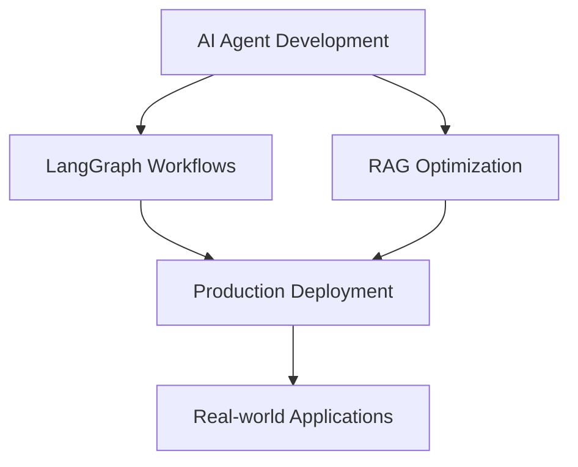

# Hi there, I'm Aftab! 👋

**💬 "Let's build the future of AI together!"**
 
</div>

---

<div align="center">
  
</div>


## 🚀 AI Engineer & Innovation Enthusiast

> *"Building the future of AI, one intelligent agent at a time"*

I'm passionate about creating **intelligent systems** that bridge the gap between human language and machine understanding. With a focus on cutting-edge AI technologies, I build practical solutions that make complex data accessible and actionable.

### 🔥 What I Do

```python
class AftabProfile:
    def __init__(self):
        self.role = "AI Engineer & Developer"
        self.focus_areas = [
            "Agentic AI Systems",
            "Large Language Models", 
            "Retrieval-Augmented Generation (RAG)",
            "Natural Language to SQL",
            "Multimodal AI Applications"
        ]
        self.current_interests = [
            "LangGraph & LangChain Ecosystems",
            "Anthropic's Model Context Protocol",
            "Advanced RAG Techniques",
            "AI Agent Orchestration"
        ]
    
    def get_mission(self):
        return "Democratizing AI through intuitive, production-ready solutions"
```


### 🛠️ Tech Stack & Tools

**AI/ML Frameworks**
```
🧠 LangChain & LangGraph    🤖 Anthropic Claude    🔥 Groq
📊 Transformers (Hugging Face)    🎯 RAG Systems    🔍 Vector Databases
```

**Languages & Platforms**
```
🐍 Python    📊 SQL    🐳 Docker    ☁️ Cloud Platforms
🌐 Gradio    📓 Jupyter    🔧 Git    🚀 API Development
```

**Specialized Tools**
```
🔗 phidata    🔍 Tavily Search    CrewAI    🎨 Streamlit
🧮 NumPy/Pandas    📈 Matplotlib    🤗 Transformers    ⚡ FastAPI
```

### 📊 GitHub Stats

<div align="center">
  


</div>

### Current Focus



-  **Researching**: Advanced agentic AI patterns and architectures
-  **Building**: Production-ready AI applications with robust error handling
-  **Learning**: Latest developments in multimodal AI and agent orchestration
-  **Collaborating**: Open to partnerships on innovative AI projects

### Philosophy

> *"The best AI systems are those that augment human capabilities rather than replace them. I believe in building AI that is transparent, reliable, and genuinely helpful."*


###  Let's Connect!

I'm always excited to discuss AI innovations, collaborate on projects, or help fellow developers navigate the AI landscape.

<div align="center">

[](https://www.linkedin.com/in/mohammed-aftab-526b7a257/)
[](https://medium.com/@aftab001x)
[](mailto:aftab001x@gmail.com)


